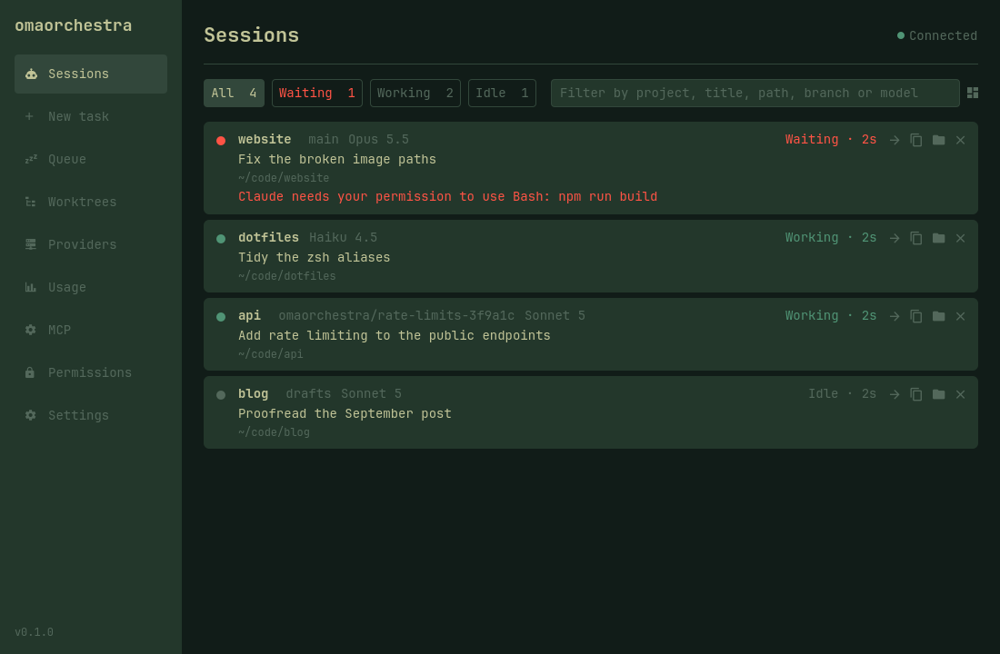
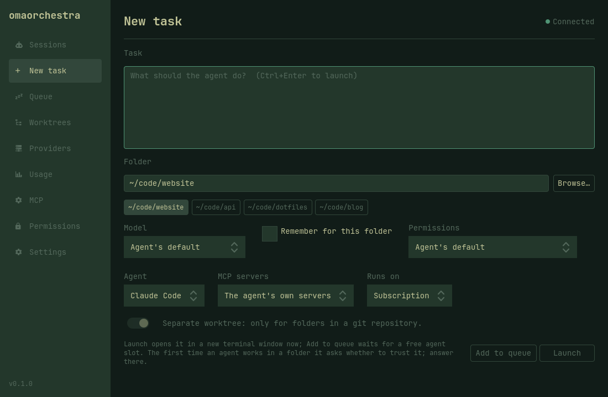
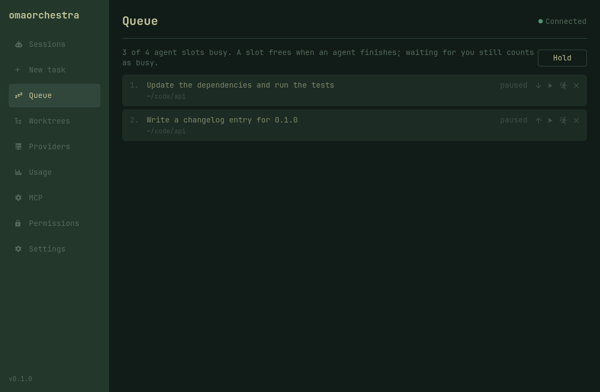

# omaorchestra

Agent coordinator and harness for [Omarchy](https://omarchy.org/).

Run AI coding agents side by side, see which are working, waiting for you,
or done, and jump into any of them from the bar, a keybinding, the terminal,
or a native desktop app. Queue tasks for when an agent frees up, give each
one its own git worktree, run agents through API providers, and manage
their MCP servers in one place.



> omaorchestra is an independent, third-party project. It is not part of, or
> endorsed by, Omarchy or any agent's vendor.

## Features

- **Sessions at a glance.** Claude Code, Codex and opencode report their
  state through their own hooks. The bar shows how many agents are working
  and turns urgent when one is waiting for you. A notification's **Focus**
  button jumps to its terminal.
- **Start and queue tasks.** `omaorchestra run` or **New task** opens an agent
  on a task in a new terminal. The queue starts tasks as agent slots free
  up, and holds while a subscription limit is nearly used up.
- **Isolated worktrees.** Each task in a git repository works on its own
  branch and worktree, and you review, merge or discard it afterwards.
- **Models and providers.** Pick models per task or per folder. Route Claude
  Code through the Anthropic API or OpenRouter, and see what sessions cost.
  Keys stay in the system keyring.
- **MCP servers.** One inventory across agents, health checks, secrets in the
  keyring, per-task server profiles, and omaorchestra itself as an MCP server.
- **Handoffs.** Move a task to another agent or model with a brief of where
  it stands.
- **Local and private.** A user service and a Unix socket only you can
  reach. The app is native Qt, not a web page, and omaorchestra itself never
  sends your prompts anywhere.

| New task | Queue |
|---|---|
|  |  |

## Install

From the AUR:

```bash
yay -S omaorchestra            # or: omarchy pkg aur add omaorchestra
sudo pacman -S pyside6         # optional: the desktop app
omaorchestra setup
```

From a checkout:

```bash
git clone https://github.com/njcurtis3/omaorchestra ~/code/omaorchestra
~/code/omaorchestra/bin/omaorchestra setup
```

A checkout runs in place; there is nothing to build. `setup` links
`~/.local/bin/omaorchestra` to it and installs the desktop entry.

## Setup

`omaorchestra setup` connects omaorchestra to your desktop. It is safe to run
again, and `--dry-run` shows what it would change first:

| Step | What it does |
|---|---|
| `service` | enables and starts `omaorchestrad` as a systemd user service |
| `hooks` | adds reporting hooks for each installed agent (Claude Code, Codex, opencode), backing up their settings first |
| `widget` | copies the bar widget into `~/.config/omarchy/plugins/` and puts it on the bar |
| `bindings` | **Super+Alt+A** jumps to the agent that needs you, **Super+Ctrl+Alt+A** toggles the sessions panel, **Super+Shift+Ctrl+Alt+A** opens the app; the app window floats, centered |
| `menu` | an **Agents** submenu in the Omarchy menu |
| `launcher` | a checkout only: the `omaorchestra` command on your PATH, and the app in the launcher |

Pick steps with `--only <step>` or `--skip <step>`. Changes to your own
files (Hyprland bindings, the window rule, the menu) go in a marked block,
so they are easy to spot and teardown removes exactly them. A file where
you already set omaorchestra up by hand is left alone.

Codex runs its hooks only after you trust them: start `codex` and use
`/hooks`.

Then:

```bash
omaorchestra app                                  # the app
omaorchestra ls                                   # sessions, in the terminal
omaorchestra run "fix the flaky test" --in ~/code/app
omaorchestra queue add "update the dependencies" --in ~/code/app
```

## Uninstall

```bash
omaorchestra teardown          # undo setup: service, hooks, widget, bindings, menu
sudo pacman -R omaorchestra    # or delete the checkout
```

`teardown` keeps your settings, state, task worktrees and keys, and prints
where each one is. To remove those too:

```bash
omaorchestra worktree list                 # merge or remove anything you want to keep first
omaorchestra provider remove <id>          # for each provider: deletes its key from the keyring
omaorchestra mcp remove <name>             # for each managed MCP server, and its secrets
rm -r ~/.config/omaorchestra ~/.local/state/omaorchestra ~/.local/share/omaorchestra
```

## Supported versions

| | Tested with | Needs |
|---|---|---|
| Omarchy | 4.0.4 | 4.x: the Quickshell bar and Lua Hyprland config |
| Hyprland | 0.56.2 | 0.55 or later for the keybindings; `focus` also works with the classic dispatcher |
| Python | 3.14 | 3.11 or later, the system `/usr/bin/python3` |
| PySide6 | 6.11 | for the app only |
| Claude Code | 2.1 | |
| opencode | 1.18 | |
| Codex | not yet | follows Codex's documented hooks (0.156); not yet tried with a live Codex session |

Omarchy's plugin APIs are still changing, so a new Omarchy release can need
a new omaorchestra release.

## Documentation

- [User guide](docs/guide.md): sessions, the app, the bar widget,
  notifications, starting and queueing tasks, worktrees, agents and handoffs,
  keybindings, configuration
- [Providers and models](docs/providers.md): API providers, model defaults,
  routing agents through a provider, costs and budgets
- [MCP servers and permissions](docs/mcp.md)
- [Troubleshooting](docs/troubleshooting.md)
- [Development](docs/development.md) and [architecture](docs/architecture.md)

## License

[MIT](LICENSE)
