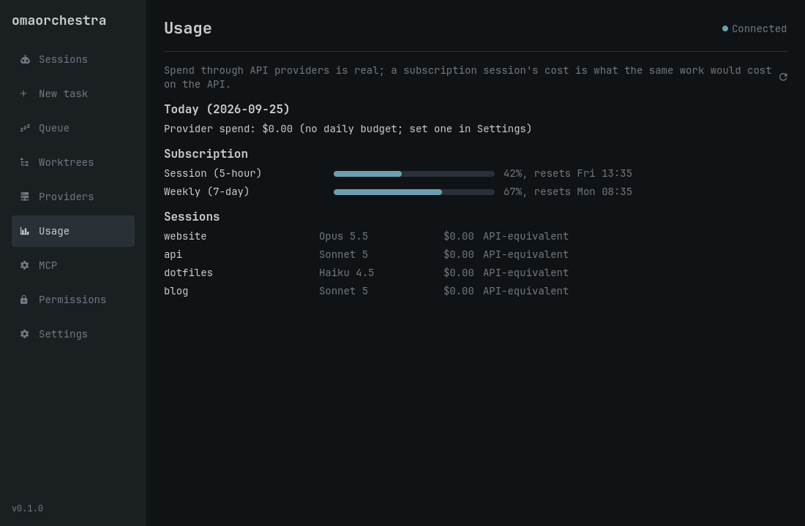
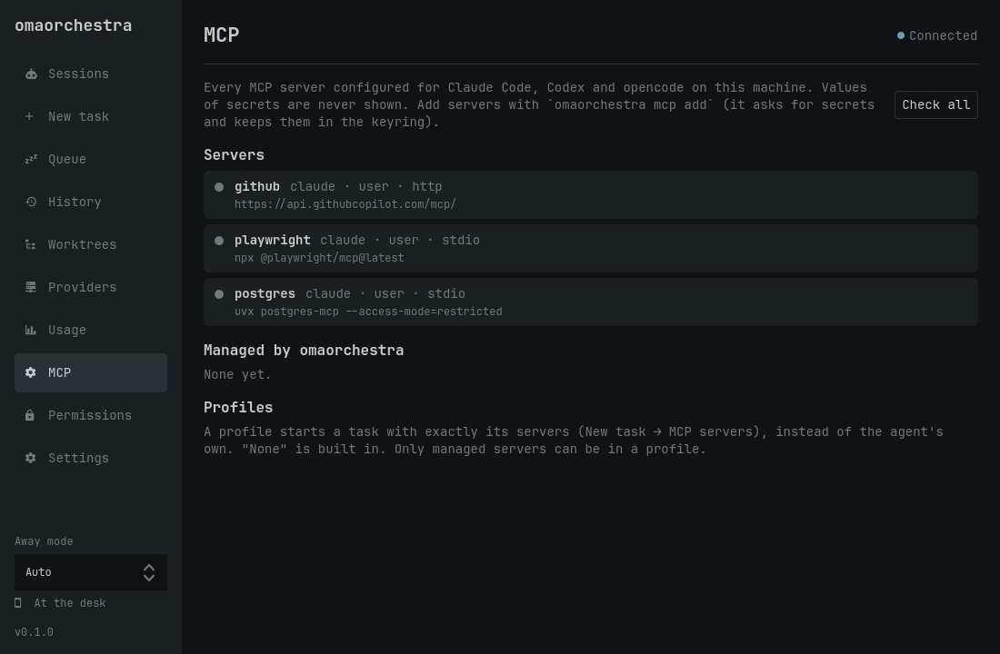

<h1 align="center">
  <picture>
    <source media="(prefers-color-scheme: dark)" srcset="docs/assets/logo-dark.svg">
    
  </picture>
</h1>

<p align="center">
  <i>Conduct your AI coding agents on <a href="https://omarchy.org/">Omarchy</a>: see who is working, who needs you, and jump straight there.</i>
</p>

<h4 align="center">
  <a href="https://github.com/njcurtis3/omaorchestra/actions/workflows/test.yml">
    
  </a>
  <a href="https://github.com/njcurtis3/omaorchestra/releases/latest">
    
  </a>
  <a href="LICENSE">
    
  </a>
  <br>
  <a href="https://omarchy.org/">
    
  </a>
  
  
</h4>

<p align="center">
  <a href="#install">Install</a> ·
  <a href="#setup">Setup</a> ·
  <a href="docs/guide.md">User guide</a> ·
  <a href="docs/commands.md">Commands</a> ·
  <a href="docs/troubleshooting.md">Troubleshooting</a> ·
  <a href="https://github.com/njcurtis3/omaorchestra/releases">Releases</a>
</p>

<p align="center">
  
</p>

## Introduction

`omaorchestra` runs AI coding agents side by side and keeps track of them for
you. Claude Code, Codex and opencode report their state through their own
hooks, and omaorchestra shows which agents are working, which are waiting for
you, and which are done. You can see them in the Omarchy bar, a native
desktop app, the terminal, or on your phone, and jump into any of them from
there.

It also starts the work. Queue tasks for when an agent frees up, give each
one its own git worktree, pick the model per task, route agents through API
providers, and manage every agent's MCP servers in one place. Everything runs
locally as a user service behind a Unix socket, with no web server and no
open port.

> [!NOTE]
> omaorchestra is an independent, third-party project. It is not part of, or
> endorsed by, Omarchy or any agent's vendor.

<details open>
<summary>
 Features
</summary> <br />

<p align="center">
  
&nbsp;
  
</p>

<p align="center">
  
&nbsp;
  
</p>

<table>
  <tr>
    <td width="50%"><b>Sessions at a glance</b><br>The bar counts working agents and turns urgent when one waits for you; <b>Focus</b> jumps to its terminal.</td>
    <td width="50%"><b>Start and queue tasks</b><br><code>omaorchestra run</code> or <b>New task</b> opens an agent in a new terminal; the queue starts tasks as slots free up.</td>
  </tr>
  <tr>
    <td><b>Isolated worktrees</b><br>Each task in a git repository gets its own branch and worktree to review, merge or discard.</td>
    <td><b>Models and providers</b><br>Pick models per task or folder, route Claude Code through the Anthropic API or OpenRouter, and see what it costs.</td>
  </tr>
  <tr>
    <td><b>MCP servers</b><br>One inventory across agents, health checks, per-task profiles, and omaorchestra itself as an MCP server.</td>
    <td><b>Handoffs</b><br>Move a task to another agent or model, with a brief of where it stands, when one hits its limit.</td>
  </tr>
  <tr>
    <td><b>Phone pushes</b><br>Optional ntfy notifications when an agent needs you or a task finishes or fails, only while you are away from the desk; minimal text by default.</td>
    <td><b>Local and private</b><br>A user service behind a Unix socket, no open port, keys in the system keyring, and a native Qt app, not a web page.</td>
  </tr>
</table>

</details>

## Install

<details open>
<summary>
 Download the package
</summary> <br />

Download the `.pkg.tar.zst` file from the
[latest release](https://github.com/njcurtis3/omaorchestra/releases/latest).
It is one package for every Omarchy machine, and each release lists its
SHA-256 checksum. Then:

```bash
sudo pacman -U ~/Downloads/omaorchestra-*-any.pkg.tar.zst
sudo pacman -S --needed pyside6    # optional: the desktop app
omaorchestra setup
```

To update, install the newer release's file the same way and run
`omaorchestra setup` again.

</details>

<details>
<summary>
 From a checkout
</summary> <br />

```bash
git clone https://github.com/njcurtis3/omaorchestra ~/code/omaorchestra
sudo pacman -S pyside6         # optional: the desktop app
~/code/omaorchestra/bin/omaorchestra setup
```

A checkout runs in place; there is nothing to build. `setup` links
`~/.local/bin/omaorchestra` to it and installs the desktop entry. To
update, `git pull` in the checkout and run `omaorchestra setup` again.

An AUR package is on the way.

</details>

## Setup

`omaorchestra setup` connects omaorchestra to your desktop. It is safe to run
again, and `--dry-run` shows what it would change first:

| Step | What it does |
|---|---|
| `service` | enables and starts `omaorchestrad` as a systemd user service |
| `hooks` | adds reporting hooks for each installed agent (Claude Code, Codex, opencode), backing up their settings first |
| `widget` | copies the bar widget into `~/.config/omarchy/plugins/` and puts it on the bar |
| `bindings` | **Super+Alt+A** jumps to the agent that needs you, **Super+Ctrl+Alt+A** toggles the sessions panel, **Super+Shift+Ctrl+Alt+A** opens the app; the app window floats, centered |
| `menu` | an **Agents** submenu in the Omarchy menu |
| `launcher` | a checkout only: the `omaorchestra` command on your PATH, and the app in the launcher |

Pick steps with `--only <step>` or `--skip <step>`. Changes to your own
files (Hyprland bindings, the window rule, the menu) go in a marked block,
so they are easy to spot and teardown removes exactly them. A file where
you already set omaorchestra up by hand is left alone.

Codex runs its hooks only after you trust them: start `codex` and use
`/hooks`.

Then:

```bash
omaorchestra app                                  # the app
omaorchestra ls                                   # sessions, in the terminal
omaorchestra run "fix the flaky test" --in ~/code/app
omaorchestra queue add "update the dependencies" --in ~/code/app
```

<details>
<summary>
 Uninstall
</summary> <br />

```bash
omaorchestra teardown          # undo setup: service, hooks, widget, bindings, menu
sudo pacman -R omaorchestra    # a package; for a checkout, delete it
```

`teardown` keeps your settings, state, task worktrees and keys, and prints
where each one is. To remove those too:

```bash
omaorchestra worktree list                 # merge or remove anything you want to keep first
omaorchestra provider remove <id>          # for each provider: deletes its key from the keyring
omaorchestra mcp remove <name>             # for each managed MCP server, and its secrets
rm -r ~/.config/omaorchestra ~/.local/state/omaorchestra ~/.local/share/omaorchestra
```

</details>

<details>
<summary>
 Supported versions
</summary> <br />

| | Tested with | Needs |
|---|---|---|
| Omarchy | 4.0.4 | 4.x: the Quickshell bar and Lua Hyprland config |
| Hyprland | 0.56.2 | 0.55 or later for the keybindings; `focus` also works with the classic dispatcher |
| Python | 3.14 | 3.11 or later, the system `/usr/bin/python3` |
| PySide6 | 6.11 | for the app only |
| Claude Code | 2.1 | |
| opencode | 1.18 | |
| Codex | not yet | follows Codex's documented hooks (0.156); not yet tried with a live Codex session |

Omarchy's plugin APIs are still changing, so a new Omarchy release can need
a new omaorchestra release.

</details>

## Documentation

- [User guide](docs/guide.md): sessions, the app, the bar widget,
  notifications, starting and queueing tasks, worktrees, agents and handoffs,
  keybindings, configuration
- [Commands](docs/commands.md): every command and option
- [Providers and models](docs/providers.md): API providers, model defaults,
  routing agents through a provider, costs and budgets
- [MCP servers and permissions](docs/mcp.md)
- [Troubleshooting](docs/troubleshooting.md)
- [Development](docs/development.md) and [architecture](docs/architecture.md)

## License

[MIT](LICENSE)
