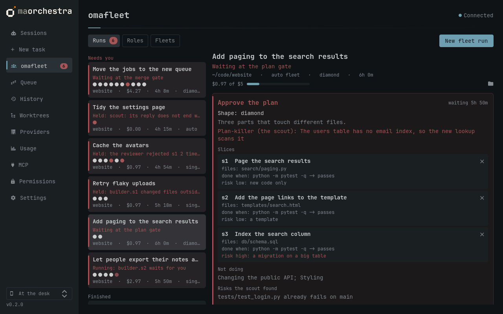

# Fleets

<!-- sections -->
**Sections:** [When a fleet is worth it](#when-a-fleet-is-worth-it) · [Starting one](#starting-one) · [How a run goes](#how-a-run-goes) · [Answering](#answering) · [Guardrails](#guardrails) · [Closing and merging](#closing-and-merging) · [What it cost and caught](#what-it-cost-and-caught) · [Watching other fleets](#watching-other-fleets) · [Reference](#reference) · [Where it comes from](#where-it-comes-from)
<!-- /sections -->

> [!WARNING]
> **Fleets are experimental.** Every part is tested (the engine, the
> gates, the checks against git, the app), and a first run has gone end
> to end with Claude Code in every role, but live runs are only beginning:
> Codex and opencode roles are untried live, and the run-state format may
> still change. Start
> with a small goal in a repository you can reset, and
> [report](https://github.com/njcurtis3/omaorchestra/issues) what goes
> wrong.

A fleet run puts several agents, each with a role, on one goal:

```
scout ─→ architect ─→ [you approve the plan] ─→ builder ─→ reviewer ─┐  a slice at a time, or
  facts     a plan of slices                     one slice   may REJECT │  every slice at once
                                                                        ↓  (a "diamond")
                                  [you approve the merge] ─→ integrator ─→ done: check it, close it
```

The scout establishes what is true before anyone plans. The architect turns
the goal into a plan of slices, each with the files it may touch and how to
check it is done. **Nothing is built until you approve the plan.** Then a
builder builds each slice and a reviewer who never saw it written checks it,
and may send it back. When the slices touch different files they are built
in parallel, each in a git worktree of its own, and an integrator merges
them once you approve the merge. Closing a run is checked against git, not
against what the agents said.



## When a fleet is worth it

For work of several parts, or work you would not merge unreviewed. A fleet
costs more than one agent: a scout, an architect and a reviewer for every
build. **One file, one bug, anything you could say in a paragraph: use a
single task** (`omaorchestra run`, or New task in the app); it is cheaper
and as good. The New fleet run form says so when a goal is short.

Parallel builders (a diamond) need all of: a git repository, three or more
slices, and no two slices touching the same file or folder. A plan that
does not qualify runs as a single loop, one slice at a time, and the run
says why.

## Starting one

- **App:** the **omafleet** tab, **New fleet run**: the goal, the folder,
  the fleet, and optionally a shape and a budget. **Run as fleet…** on New
  task carries a task's text and folder over.
- **Command line:**

  ```bash
  omaorchestra fleet run "add pagination to the search results" --in ~/code/app
  omaorchestra fleet run "…" --fleet careful --budget 5 --shape single-loop
  ```

Each agent is a queued task in a terminal of its own, so the queue's limits
apply: the parallel limit, the daily budget, and usage limits. The first
time an agent works in a folder, Claude Code asks whether to trust it;
answer in its window. Every agent shows in Sessions, with a chip naming its
run and role. An agent's window stays open after its reply is read, so you
can look back at its work; once the node is done the run no longer needs
it, and an idle window holds no queue slot. Close it when you like.

## How a run goes

1. **Scout** (read-only): facts with their `file:line`, unknowns, risks,
   and the one finding that would change the plan.
2. **Architect** (read-only): the plan and its shape. The run waits at the
   **plan gate**.
3. After you approve, the run gets a branch and worktree of its own,
   `omaorchestra/fleet-<run>`.
   - **Single loop:** for each slice in order (the ones it depends on
     first), a builder builds it on the run's branch, then a reviewer checks
     it.
   - **Diamond:** every slice at once, each on a branch and worktree of its
     own (`omaorchestra/fleet-<run>-<slice>`), each reviewed; then the run
     waits at the **merge gate**, and the integrator merges the slices into
     the run's branch and runs the whole test suite.
4. A **REJECT** sends the slice to a new builder with the review's
   findings, then to a new reviewer. After `tries` rejected builds (2 by
   default) the run holds for you.
5. When every slice has passed, the run is **finished**: check it and close
   it.

### Recursive slices

A builder may find its slice too big to build as one change. When its
fleet's `max_depth` allows (the default, 1, does not), the builder can
**split** the slice instead of building it: it changes nothing and replies
with smaller slices, in the architect's shape.

```
builder s2 ─ split ─→ s2-a: builder → reviewer ─→ s2-b: builder → reviewer ─→ reviewer s2 (the whole)
```

- The smaller slices (`s2-a`, `s2-b`...; `s2-2a` for a second build's split)
  run one at a time, in the order their edges allow, in the slice's own
  worktree and branch. Each is built and reviewed like any slice, with its
  own `tries`, and may split again while the depth allows.
- When all of them have passed, a reviewer checks the slice as a whole,
  against its own done-when. A REJECT sends it to a new builder, which may
  build it or split it again.
- A split is refused, and holds the run like any unreadable reply, when
  the fleet allows no deeper split, when a smaller slice reaches past the
  slice's files, or when the builder changed something.
- A split does not wait for you: it cannot reach past files you already
  approved, and the scope check holds any builder that does. Set
  `split_gate = true` on a fleet to approve each split anyway, at a
  **split gate** (`fleet approve <run>`).
- Every agent a split starts counts against `max_steps` and `budget`.

The board, `fleet show` and `top` list the smaller slices under their slice.

Each agent is told what it needs and no more: its role's instructions, then
a brief built from the run so far (the goal, the scout's facts, its slice,
the review that sent it back...), then the JSON block its final reply must
end with. omaorchestra reads that block, checks it, and records it; an agent
never writes the run's state itself. See [What each role hands
back](#what-each-role-hands-back).

## Answering

Everything that waits on you appears as a card at the top of the run in
omafleet, in the Fleets tab of `omaorchestra top` (for your phone), as a
notification, and as a push while you are away. The bar counts runs that
need you, and its panel lists them.

**At the plan gate:**

| App | Command | Does |
|---|---|---|
| Approve | `fleet approve <run>` | the builders start |
| Send back… | `fleet send-back <run> "note"` | a new architect plans again, with your note and the plan before |
| ✕ on a slice | `fleet drop <run> <slice>` | leaves it out (not the last one, nor one another depends on) |
| Run as single loop / Try as diamond | `fleet shape <run> single-loop\|diamond` | how to run it; a diamond is still checked |
| Cancel run | `fleet cancel <run>` | nothing more starts |

**At the merge gate:** approve (`fleet approve <run>`) or cancel.

**At a split gate** (only when the fleet sets `split_gate`): approve
(`fleet approve <run>`), and the builder's smaller slices start, or cancel.

**When it holds:**

| Held because | Answer |
|---|---|
| a reply without its JSON block, or a block that does not check | **Try again** (`fleet retry <run> [--note ...]`), or ask the agent in its window to end with the block: its next reply is read again |
| an agent's session stopped, crashed, or could not start | **Try again** (`fleet retry`) |
| a slice rejected `tries` times | **Another try** with a note (`fleet retry --note`), or **Take over**: its builder's window, to work in yourself |
| a builder reported itself blocked | **Try again** with what it needs (`fleet retry --note`) |
| a builder changed files outside its slice | **Accept them** with your reason (`fleet accept-files <run> <builder> "why"`), which the reviewer is told, or **Send back to undo them** (`fleet undo-files <run> <builder>`) |
| a builder or the integrator ended on another branch | **Try again**: a run's work never lands on your branches |
| the integrator's suite failed, or it would not reconcile two slices | **Try again** with a note, or cancel |
| the budget or the step limit | **Raise** them (`fleet limits <run> --budget 10 --steps 40`) |
| you paused it | **Resume** (`fleet resume <run>`) |

Answers from inside an agent are refused, as for permission prompts: an
agent cannot approve its own plan. While a run runs, **Pause** (`fleet
pause`) stops anything new from starting; agents already working go on.

## Guardrails

- **The plan gate** comes before any code, and nothing auto-approves.
- **The scope check.** When a builder finishes, git lists every file it
  changed (committed, uncommitted, new); any outside its slice's files hold
  the slice before review. No hook blocks it while it works. New caches that
  running the tests leaves (`__pycache__/`, `*.pyc`, `.pytest_cache/`,
  `.coverage`...) are not counted, here or when closing, even where the
  repository does not ignore them; a committed one is.
- **Branches.** Builders and the integrator must end on their own branch;
  merging the run's branch into yours is always yours to do.
- **Budget and steps.** A fleet's `budget` (US$, API-equivalent on a
  subscription) and `max_steps` hold the run when reached. Each agent's
  cost is recorded when it ends.
- **Waiting and stalls.** A node waiting for you is marked (the run pauses
  on it), and one working with no sign of life for `stall_minutes` is
  flagged, once, with a notification. Nothing is stopped for you.
- **The queue.** Every agent obeys the parallel limit, the daily budget
  and usage limits, like any task.

## Closing and merging

`fleet close <run>` (Check it, then Close it, in the app) checks git first:

- every slice built, its latest build reviewed PASS, and its commits on the
  run's branch (for a diamond, merged there by the integrator);
- at least one commit per slice, and nothing left uncommitted;
- every file the run's branch changed is in a slice's files, or one you
  accepted;
- a diamond's integrator merged every slice and its suite passed.

Then it removes the slices' worktrees. The run's branch stays, with its
worktree, for you to merge like any task's: `omaorchestra worktree merge
omaorchestra/fleet-<run>`, or Merge on the Worktrees page.

## What it cost and caught

`fleet report <run>` (the **Report** view in omafleet) is a run's
postmortem: time working and waiting for you and cost, per role and per
agent; each slice's builds and REJECTs; how long the gates and holds waited;
and how parallel the builders really ran. `fleet stats [--days N]` (and
**Fleet roles** on the Usage page) adds your runs up per role: what each
role costs, its share, and how often reviewers sent a build back.

## Watching other fleets

omafleet also shows runs it did not start, read-only, in an **Outside**
group, and never writes to them:

- **graph_agents** runs, from each folder in `fleets.watch`: a graph_agents
  checkout, or the folder that holds one. They get the graph, board,
  timeline (a lane per agent it started) and report.
- **Claude Code agent teams** (`~/.claude/teams`) while they run
  (`fleets.agent_teams`, on by default): the members and the task list.

```toml
[fleets]
watch = ["~/repos/graph_agents"]
agent_teams = true
```

`fleet list --outside`, `fleet show graph_agents:<run>` or `team:<name>`,
`fleet report graph_agents:<run>`.

## Reference

### Roles

A role is a Markdown file in Claude Code's subagent format: fields at the
top, the role's instructions below. The first role with a name wins, looking
in:

1. the project: `.claude/agents/**/*.md` in the folder and each folder above
   it up to the repository's root, closest first;
2. yours: `~/.config/omaorchestra/roles/*.md`;
3. the built-ins: `scout`, `architect`, `builder`, `reviewer`, `integrator`.

| Field | Meaning |
|---|---|
| `name` | the role's name (else the file's); letters, digits, `-`, `_`, `.` |
| `description` | one line, shown in lists |
| `tools` | the tools it may use (`Read, Grep, Bash`); without it, all. None that write (Write, Edit, NotebookEdit) makes it **read-only** |
| `disallowedTools` | tools it may not use |
| `model` | the model (`opus`, `sonnet`, `haiku`, a full id, or `inherit`) |
| `permissionMode` | Claude Code's permission mode for it |
| `effort` | `low` to `max` |
| `agent` | omaorchestra's own field, which Claude ignores: `claude` (default), `codex` or `opencode` |

How each agent takes on a role: Claude Code runs as it (`--agents` and
`--agent`); Codex gets its instructions as developer instructions, and a
read-only role runs in Codex's read-only sandbox; opencode gets it as an
agent of its own, passed in `OPENCODE_CONFIG_CONTENT` (never written to its
config), with editing, shell and web tools denied when the role lacks them.
Claude's model names and permission modes apply only when Claude runs the
role.

```bash
omaorchestra role list            # every role, where it comes from, what it hides
omaorchestra role show builder    # its fields and instructions
omaorchestra role check           # role files that cannot be used, and why
omaorchestra run "…" --role reviewer    # a role on its own, outside a fleet
```

To change a built-in, copy it to yours (**Copy to mine** in omafleet's Roles
view) and edit that.

A role's instructions cannot turn off what the agent itself adds to
commits: Claude Code's own `Co-Authored-By` trailer wins over a role that
forbids it. To keep trailers out of a fleet's commits, turn it off in
Claude Code's settings (`~/.claude/settings.json`):

```json
{ "attribution": { "commit": "", "pr": "" } }
```

### fleets.toml

Built in: `auto` (the architect picks the shape), `single-loop`, `diamond`
(`fleet templates`, or omafleet's Fleets view). Yours go in
`~/.config/omaorchestra/fleets.toml`; one with a built-in's name replaces
it.

```toml
[fleets.careful]
description = "Single loop, reviewed by my security reviewer"
shape = "single-loop"
scout = true
tries = 2
budget = 5
max_steps = 30
stall_minutes = 20
max_depth = 1
split_gate = false
[fleets.careful.roles]
reviewer = "security-reviewer"
```

| Key | Default | Meaning |
|---|---|---|
| `description` | | shown in lists |
| `shape` | `auto` | `auto` (the architect's call), `single-loop`, or `diamond` (still checked) |
| `scout` | `true` | `false`: straight to the architect |
| `tries` | `2` | builds of a slice (1 to 5) before a REJECT holds the run |
| `budget` | `0` | US$ the run may spend (API-equivalent on a subscription); 0: no budget |
| `max_steps` | `30` | agents the run may start in all (3 to 200) |
| `stall_minutes` | `20` | a working agent with no sign of life this long is flagged |
| `max_depth` | `1` | how deep slices may [split](#recursive-slices) (1 to 4): 1, none; 2, a slice of the plan once |
| `split_gate` | `false` | `true`: each split waits for you at a split gate |
| `roles.<stage>` | the stage's name | the role that plays `scout`, `architect`, `builder`, `reviewer` or `integrator` |

The stages and their order are fixed; a fleet changes who plays them, the
shape, the scout, how deep slices may split, and the limits. A run keeps the fleet's settings it started
with.

### What each role hands back

Each agent's final reply ends with one fenced `json` block in its role's
shape (the full shape and an example are in its task). omaorchestra keeps
only these fields, cuts long output short, and refuses what contradicts
itself.

| Role | Fields | Refused when |
|---|---|---|
| scout | `facts` (each `fact` and `where`), `unknowns`, `risks`, `build` (`green`, `red`, `not run`), `plan_killer` | |
| architect | `shape`, `rationale`, `slices` (each `id`, `intent`, `files`, `done_when`, `risk`, `risk_why`), `edges` (each `from`, `to`, `artifact`), `not_doing`, `approve` | two slices share an id; a file outside the repository; an edge to no slice, or edges in a circle |
| builder | `status` (`done`, `blocked`, `split`), `changed`, `done_when` (`command`, `output`, `passed`), `blocked`, `noticed`, `split` (`rationale`, `slices` as the architect's, `edges`) | `done` on a failing command; `blocked` without saying why; no `done_when` unless split; a split with fewer than 2 slices, or the architect's refusals |
| reviewer | `verdict` (`PASS`, `REJECT`), `findings` (each `severity`, `where`, `what`, `origin`), `summary`, `reran` | a REJECT without a `blocker` finding; a PASS with one |
| integrator | `merged`, `conflicts` (each `slices`, `resolution`), `suite` (`command`, `output`, `passed`), `blocked`, `escalate` | a failed suite without saying which merge broke it |
| any other role | `status`, `summary`, `blocked` | `blocked` without saying why |

A split is also refused, once read, when the fleet's `max_depth` allows no
deeper split, a smaller slice's files reach past the slice's, or git shows
the builder changed something.

### Files

| File | Holds |
|---|---|
| `~/.local/state/omaorchestra/fleets/<run>/state.json` | the run: goal, folder, status, plan, and each node with its result and who wrote it |
| `~/.local/state/omaorchestra/fleets/<run>/activity.jsonl` | one line per event: a node started, waited, worked, ended; gates, holds, answers |
| `~/.local/state/omaorchestra/fleets.json` | the runs not over, in brief, for the bar widget |
| `~/.config/omaorchestra/roles/*.md` | your roles |
| `~/.config/omaorchestra/fleets.toml` | your fleets |

Every command is on the [commands page](commands.md#omaorchestra-fleet).

## Where it comes from

The roles, the plan gate, the reviewer's authority to reject, the stop rule,
closing against git, and the postmortem are adapted from
[graph_agents](https://github.com/njcurtis3/graph_agents), a fleet for
Claude Code by the same author, whose own role files load here unchanged.
omaorchestra's daemon runs the graph itself (so a run survives a closed
terminal and can be answered from a phone), any role can be Claude Code,
Codex or opencode, and the run's state is written only by the daemon.
